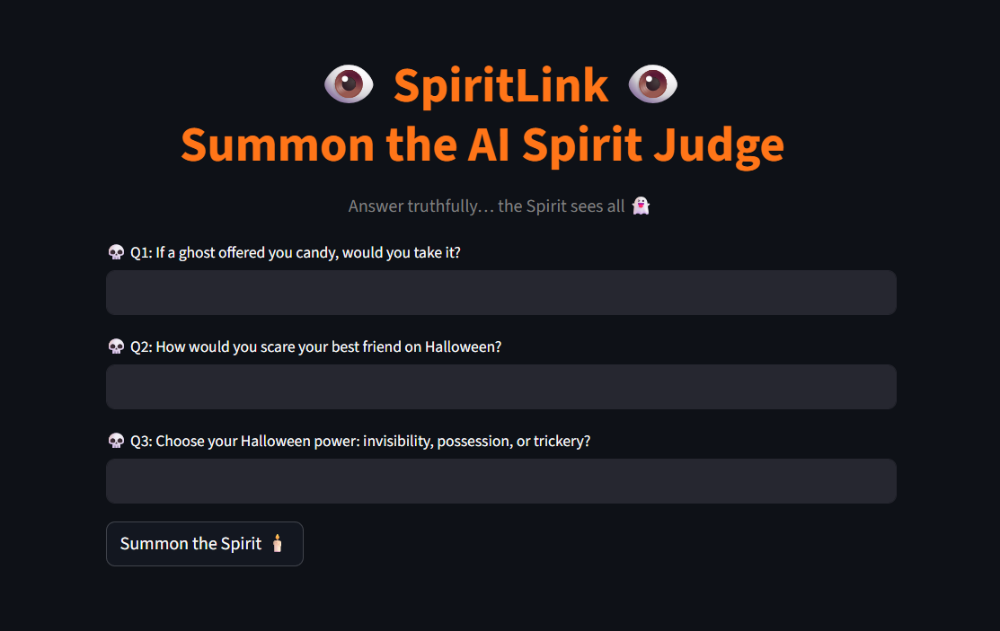
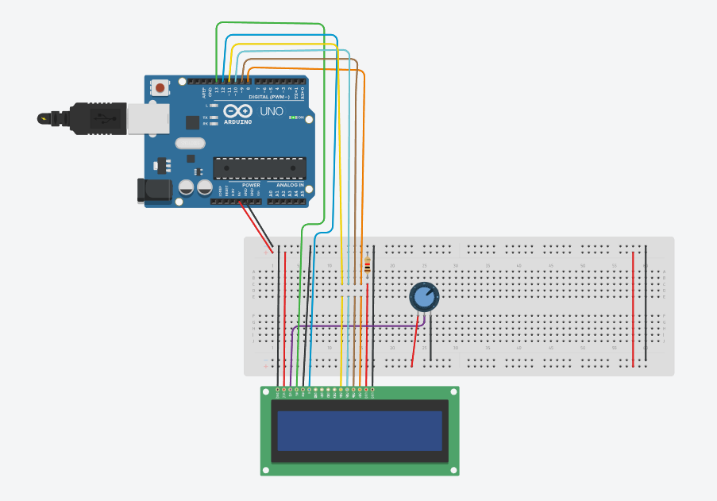

# SPIRITLINK 👻

SPIRITLINK is a fun spooky app where a customized AI agent verdict the user's spooky essence and give them an advice according to their answers.
For the Hardware part, I used an Arduino LCD that display's the user's spooky level.

## Used Libraries and Technologies
- streamlit 
- openai (OpenRouter)
- pygame 
- pyserial 
- python-dotenv
- Arduino

## How to run the app
(note that the api key has been deactivated)
1. Activate the venv using `_env_\Scripts\activate`
2. Libraries should already be installed but in case of conflicts or anything use this command to install all libraries `pip install streamlit openai pygame pyserial python-dotenv`
3. Run app with a dark theme: `streamlit run app.py --theme.base dark`

## To enable the LCD
Upload the `lcd.ino` file into an LCD

This is the circuit board:

