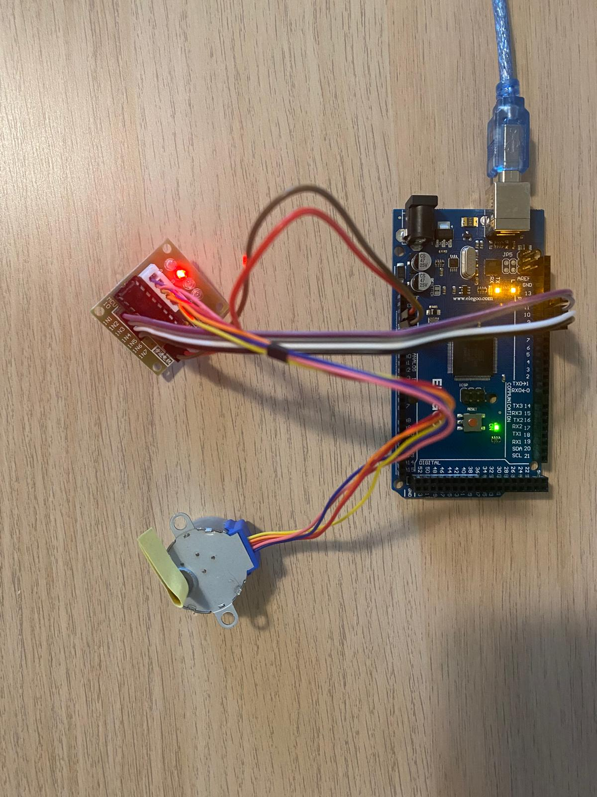
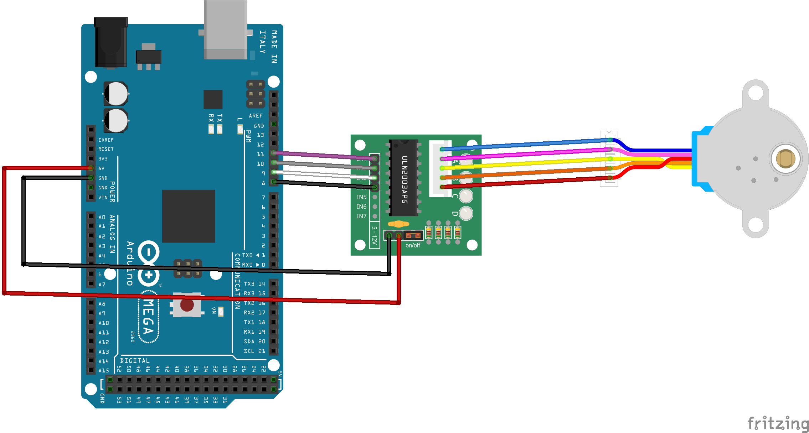
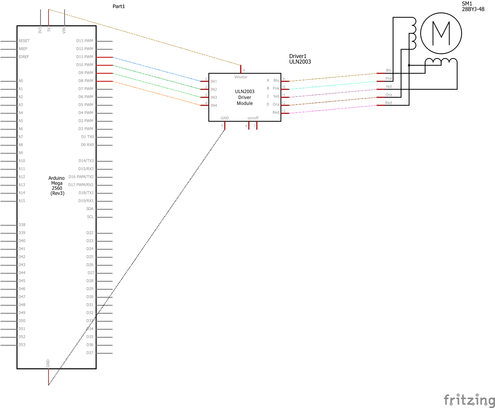
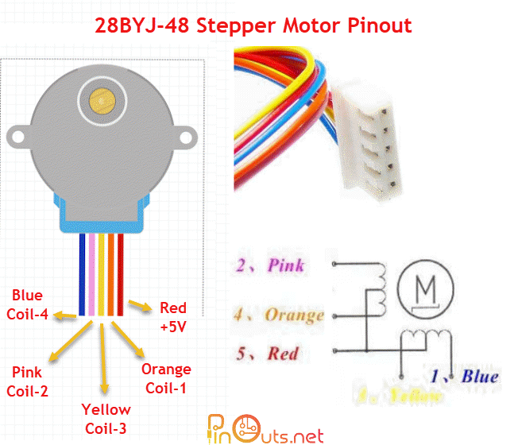
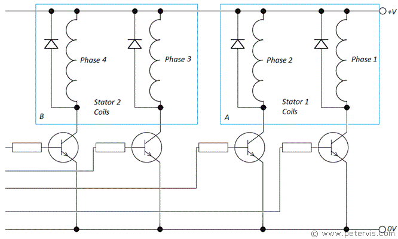
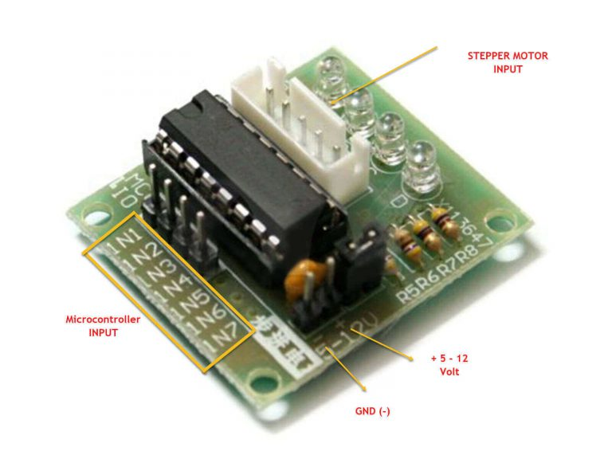

## Content
This project demonstrates how to use a 28BYJ-48 stepper motor with a ULN2003A driver board, connected to an Arduino Mega2560. It allows the motor to rotate both clockwise and counterclockwise, helping us study the motor's behavior and functionality.

## [Live Demo](./assets/28BYJ-48-step-motor.mp4)

https://github.com/user-attachments/assets/3bd92e57-b53c-4955-8fb0-265501a93fe9

## How it works
To activate the motor, a LOW signal should be sent to the coils at a certain frequency, explained more in **Table 1** below! 

## Components:
- 1x Arduino Mega2560
- 1x 28BYJ-48 step motor
- 1x ULN2003A driver board
- 6x F-M wires

## Set up
 

## Wiring Diagram

## Circuit Schematic

[Fritzing project](./28BYJ-48-step-motor.fzz)

**28BYJ-48 step motor details:**
---
- 2048 steps/revolution
- minimum delay between steps: 2ms
- max speed: 500 steps/s

 

|Step|1|2|3|5|
|----|-|-|-|-|
|IN1 |1|0|0|0|
|IN2 |0|1|0|0|
|IN3 |0|0|1|0|
|IN4 |0|0|0|1|

| 1=HIGH, 0=LOW

---

**Table 1:** How to shift signals to control a 28BYJ-48 Stepper Motor in Full Stepping

 

 

**Image 1:** 28BYJ-48 Stepper Motor Pinout. [source](https://pinouts.net/28byj-48-stepper-motor-pinout-and-specifications/)
 

 

**Image 2:** Sample Stepper Motor driver circuit. [source](https://pinouts.net/28byj-48-stepper-motor-pinout-and-specifications/)
 

 

**Image 3:** ULN2003 Driver Board. [source](https://pinouts.net/28byj-48-stepper-motor-pinout-and-specifications/)
 

