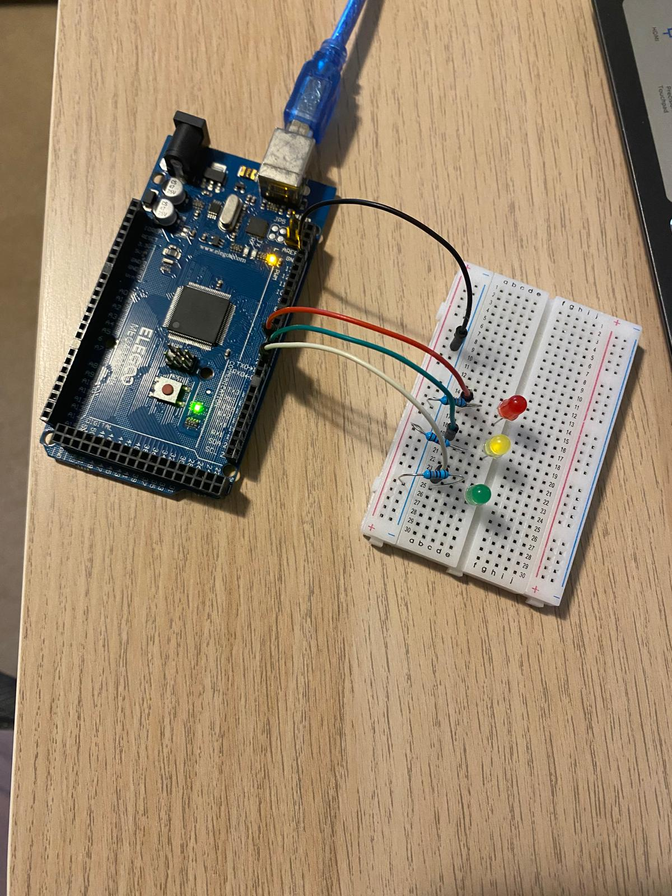

## Content

This project demonstrates a simple Arduino setup where three LEDs (Green, Yellow, and Red) are controlled to turn on and off alternatively. The LEDs are connected to the Arduino's digital output pins, and a basic program is used to create an alternating lighting pattern.

## Live Demo

https://github.com/carrot03/Arduino/assets/113475602/8fdbbbdf-5b8c-4d74-9c4e-60dbcd532dee

## How it works
1. **Circuit Setup**: Each LED is connected to a digital pin on the Arduino through a resistor to limit the current.
2. **Programming**: The Arduino is programmed to turn each LED on and off in a sequence. When one LED turns off, the next one turns on, creating an alternating pattern.
3. **Timing Control**: The delay function of 5 seconds is used to control the timing of each LED's state change, allowing for a clear and visible alternation.

## Components:

- Arduino Mega 2560
- 3 x Resistors
- 3 x LEDs
  - 1 x red
  - 1 x green
  - 1 x yellow
- 3 x Male-Male Jumper wires/Solid Core Wires

## Setup

## References

- [The Robotics Back-End](https://roboticsbackend.com/arduino-led-complete-tutorial/)
- [4 LED Digital Output](https://github.com/MFarabi619/Arduino/tree/main/Projects/4%20LED%20Digital%20Output)
