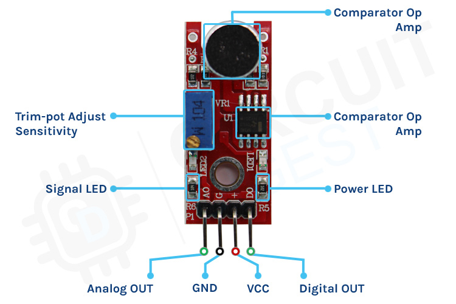

## Content
This project demonstrates the usage of the Sound sensor to light up the LED if the detected sound is higher than the set threshold value. The detected value when the LED is on, is displayed on the LCD screen. [Fritzing project](./sound-sensor.fzz)

## [Live Demo](./assets/sound-sensor-video.mp4)

https://github.com/user-attachments/assets/e4b58002-cdfa-4b54-91da-cae17e5d4bda

[**Serial Plotter Demo**](./assets/sound-sensor-serial-plotter.mp4)

https://github.com/user-attachments/assets/a654b19c-7af5-4ac2-a2a1-4852e062c3f0

*note*: The pause occurs when the detected sound is higher than the set threshold value in code, because of the added delay value of 2ms.

## How it works
When the detected analog data read by the AOUT is higher than the set threshold value, the LED goes on and the value shows up on the LCD screen. 
The potentiometer (referred to **Trim-pot Adjust Sensitivity** in image 1) is used for increasing the increment. It sets up the threshold value for digital output of the sensor. 

## Components:
- 1x Arduino Mega2560
- 1x Sound Sensor STM32
- 1x breadboard
- 2x 220 OHM Resistors
- 1x LED
- 1x Potentiometer
- 3x F-M wires
- 21x M-M wires

## Set up
 

## Wiring Diagram

## Circuit Schematic

 

| PINOUT | VALUE |     DESCRIPTION     |
|--------|-------|---------------------| 
| VCC    | 3.3v  |     Power input     |
| GND    |  GND  |       Ground        |
| AOUT   | ----  | Analog data output  |
| DOUT   | ----  | Digital data output |

**Table 1**: Description of the PINOUTs of the STM32 Sound Sensor 

| The working frequency range of the sound sensor is **50Hz ~ 20KHz**.

 

**Image 1:** Sound Sensor Module Parts. [source](https://circuitdigest.com/microcontroller-projects/interfacing-sound-sensor-with-arduino)
 

 

**Image 2:** Sound Sensor Module PINOUT. [source](https://circuitdigest.com/microcontroller-projects/interfacing-sound-sensor-with-arduino)
 
